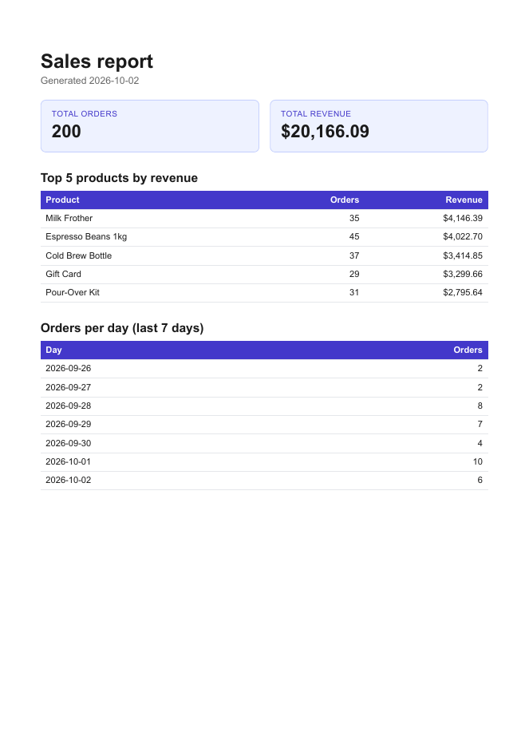

# Assignment 5: PDF Report Generator

A Next.js API that queries a SQLite database, renders the result into a real PDF with headless Chromium (Playwright), stores the file on disk and hands it out by link. It builds on [Assignment 4](../a4-auth-supabase): the Supabase bearer-token guard from `lib/auth.ts` protects every report endpoint, and each user only sees their own reports.

The pipeline is four small moves:

| Move   | What happens                                                         | Where                                |
| ------ | -------------------------------------------------------------------- | ------------------------------------ |
| Query  | One SQL query per section turns 200 rows into a handful of numbers   | `lib/reports/data.ts`                |
| Render | HTML template -> Chromium `page.pdf()`                               | `lib/reports/render.ts`              |
| Store  | PDF written to `reports/<id>.pdf`; only its file name goes in the DB | `lib/reports/service.ts`             |
| Serve  | `GET /api/reports/:id/file` streams the file from disk               | `app/api/reports/[id]/file/route.ts` |

## Dataset

**Option A - the little shop.** `report.db` has an `orders` table (`id`, `customer`, `product`, `amount`, `created_at`) seeded with 200 random orders: 6 products, amounts between $5 and $200, dates within the last 30 days. A second table, `reports` (`id`, `user_id`, `path`, `created_at`), is the report bookkeeping. Both tables are created automatically on first use.

## Run it

Requirements: [Bun](https://bun.sh/) and Node.js 24+ (the scripts use the built-in `node:sqlite` module and run `.ts` files directly).

```bash
bun install
bunx playwright install chromium   # one-time, ~1 min

cp .env.example .env.local         # add your Supabase URL + publishable key (see Assignment 4)

bun run seed                       # create + fill report.db (safe to run twice: it wipes orders first)
bun run dev                        # API on http://localhost:3000
```

Other scripts:

| Command               | What it does                                                          |
| --------------------- | --------------------------------------------------------------------- |
| `bun run report:data` | Prints the aggregated report data as JSON (Stage 2 checkpoint)        |
| `bun run report:test` | Renders `reports/test.pdf` straight from the database (Stage 3)       |
| `bun run test`        | Seeds a throwaway DB and tests aggregation, idempotency and ownership |

`report.db` and `reports/` are generated artifacts and are git-ignored; the seed script is their recipe.

## API

All endpoints except `/api/health` need `Authorization: Bearer <access_token>` (get one from `POST /api/auth/login`, exactly as in Assignment 4).

| Method | Endpoint                | Success                                                              |
| ------ | ----------------------- | -------------------------------------------------------------------- |
| `GET`  | `/api/health`           | `200 { "status": "ok" }`                                             |
| `GET`  | `/api/reports`          | `200` list of your reports, newest first                             |
| `POST` | `/api/reports`          | `201 { id, file }` for a new report, `200` if today's already exists |
| `GET`  | `/api/reports/:id`      | `200 { id, created_at, file }`, `404` if unknown (or not yours)      |
| `GET`  | `/api/reports/:id/file` | `200 application/pdf`                                                |

`POST /api/reports` accepts an optional `{ "force": true }` body to skip the "already generated today" check. Swagger UI at `/docs` lists the same endpoints.

The browser dashboard at `/protected` has a **Sales reports** card on top of the tasks card: _Generate report_ (idempotent), _Generate new anyway_ (`force: true`), and a list of your reports with _Download PDF_ buttons. The download goes through `fetch` with your session token, since the file endpoint needs the bearer header.

## Aggregation SQL

Defined in [`lib/reports/data.ts`](lib/reports/data.ts):

```sql
-- total orders and total revenue
SELECT COUNT(*) AS orders, COALESCE(SUM(amount), 0) AS revenue FROM orders;

-- top 5 products by revenue
SELECT product, COUNT(*) AS orders, SUM(amount) AS revenue
FROM orders
GROUP BY product
ORDER BY revenue DESC
LIMIT 5;

-- orders per day for the last 7 days (days with no orders are filled in as 0 in code)
SELECT created_at AS day, COUNT(*) AS orders
FROM orders
WHERE created_at >= ?   -- today minus 6 days
GROUP BY created_at;

-- long table at the end of the PDF
SELECT id, customer, product, amount, created_at
FROM orders
ORDER BY created_at DESC, id DESC;
```

## Proof: POST -> download

```text
$ time curl -si -X POST http://localhost:3000/api/reports -H "Authorization: Bearer $TOKEN"
HTTP/1.1 201 Created
{"id":"bffd4f94-2200-46d4-ac28-38f6c266a18d","file":"/api/reports/bffd4f94-2200-46d4-ac28-38f6c266a18d/file"}
real    0m0.640s

$ curl -o my-report.pdf http://localhost:3000/api/reports/bffd4f94-2200-46d4-ac28-38f6c266a18d/file \
    -H "Authorization: Bearer $TOKEN"
$ file my-report.pdf
my-report.pdf: PDF document, version 1.4, 7 page(s)

$ curl -si -X POST http://localhost:3000/api/reports -H "Authorization: Bearer $TOKEN"   # second click
HTTP/1.1 200 OK
{"id":"bffd4f94-2200-46d4-ac28-38f6c266a18d", ...}                                        # same id, no new file

$ curl -si -X POST http://localhost:3000/api/reports -H "Authorization: Bearer $TOKEN" \
    -H "Content-Type: application/json" -d '{"force":true}'
HTTP/1.1 201 Created
{"id":"1ca431b7-251a-4977-abeb-96bdf472a34e", ...}                                        # new id, new file
```

These were captured against the running app with a local stand-in for Supabase's `/auth/v1/user` endpoint, so the numbers are from a real run but the token was a fake one.

Page 1 of a generated report (the long orders table follows on pages 2-7, with its header row repeated on every page and no row split across a page break):



## Stage 4 - when would I move this work out of the request?

Right now the whole pipeline (query, launch Chromium, render, write the file) runs inside `POST /api/reports`; I would move it into a background job once a report takes more than a few seconds (bigger data, many users at once, or slower hosting), because a request that is held open that long can time out, ties up a server worker, and leaves the user stuck waiting.

## Stage 5 - what the "already generated today" check protects against

The check makes a repeated `POST /api/reports` (a double-click, a retry after a timeout) return the existing report instead of rendering a second PDF, so the same request twice has one effect and one file; concurrent requests from the same user also share a single in-flight run. A real-world example where a missing check costs money: a job that emails every customer their monthly invoice and, when retried after a crash, emails them all again, which means duplicate invoices, confused customers, support tickets and sometimes double charges.

## Notes and limitations

- **Single process.** The concurrent-request guard (`inFlight` in `lib/reports/service.ts`) is an in-memory map, so it only de-duplicates within one server process. Across several instances you would need a database constraint or lock.
- **"Today" is UTC.** Both the order dates and the "already generated today" cutoff use UTC dates.
- **Ownership.** Reports are tied to the Supabase user id. Another user's report id returns `404`, not `403`, so ids can't be probed.
- **Docker.** Assignment 4's Docker setup was not carried over: the image would also need Node and Chromium's system libraries for Playwright.
- **Browser per request.** Each report launches and closes its own Chromium instance. That is simple and fine at this scale; a long-lived shared browser would be the first optimisation.
